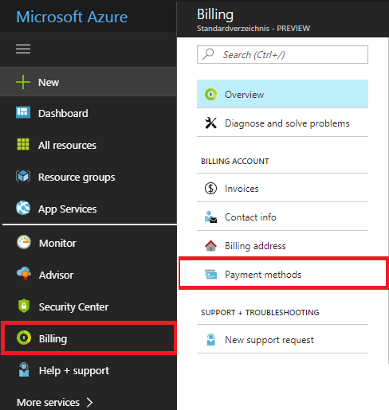

# Bing Speech API

Step by step Guide.
<!-- MarkdownTOC -->

- [Requirements](#requirements)
- [Microsoft Azure registration](#microsoft-azure-registration)
- [Subscription plan](#subscription-plan)
- [Bing Speech Service](#bing-speech-service)
- [Used online sources](#used-online-sources)

<!-- /MarkdownTOC -->

## Requirements

- Valid Credit Card 
    - Service can be used for free! But you need to deposit a payment method.

## Microsoft Azure registration

- Create new [Azure](https://azure.microsoft.com/de-de/free/) Account

- Deposit a Payment Method - e.g. Credit Card
    - You will receive 170 Euro welcome bonus for the first month. (You have to spend that in this month)
- [Log-In](https://portal.azure.com/#dashboard/private) with your new Account 

## Subscription plan

- You have two options:
    1. Use your free trial subscription (ends after 30 days)
        - Go back to Azure Dashboard
    
    2. Create a new subscription (recommended)
    
        - Create new subscription for user-based payment
        
        
        
        - Click on that  button    
        - Create new subscription for user-based payment
        - Go back to Azure Dashboard

## Bing Speech Service

- Create a new Bing Speech Service (initialization might take a while)

    - Choose your subscription plan
    - Choose your pricing plan (here you should choose the F0 - free tier - for 5k calls in a month)
    
    

- Go back to Azure Dashboard and click on your new Service
- The secret keys and your subscription id is necessary for your authentication. You have to copy & paste them to your config.properties

## Used online sources
- [Bing Speech API overview](https://docs.microsoft.com/de-de/azure/cognitive-services/speech/home)